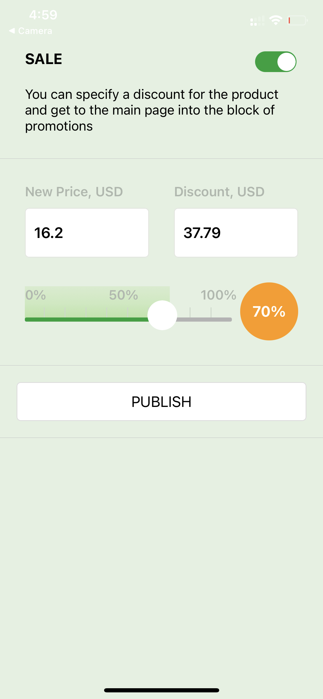
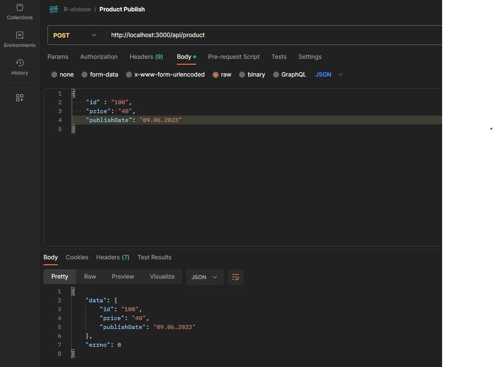

# Rainbow-Task

This is a project that follows a separate development model for the front-end and back-end. The front-end development utilizes 1. React Native, 2. TypeScript, and 3. RTK (Redux Toolkit) technology. The back-end development is primarily based on 1. Nest.js and 2. TypeScript, with nodemon used to enable global listening during development. The whole project has been debugged into the expo environment on a personal iOS device.

The project's functionality revolves around mock data generated using mock.js. Each network request retrieves different product data (original price and discount) whenever the project is reloaded. The sales and publish status are also initially set to false on the server side. Upon entering the page, users have the option to adjust the price displayed in the middle. Once a product is needed to be confirmed for publication, users can activate the Sale status by clicking the switch at the top, which simultaneously enables the Publish button below. Clicking the Publish button sends the product details (including the product ID, final price, and publish date) to the server, after which the button is disabled again.
<br />
<br />


<br />
<br />


## Usage
### Front End

Terminal
```sh
$ cd rainbowFrontEnd
$ npm install

# Original React Native
$ npm start
# ---------------------
# Expo React Native
$ expo start
```

### Back End
```sh
$ cd rainbow-back-end
$ npm install

# Original Nest.js
$ npm run start
# ---------------------
# Nodemon (Continuous monitoring)
$ nodemon --exec
```

## Technologies In This Project
### Front End

1. React Native
2. Redux Toolkit
3. TypeScript

### Back End

1. NestJs
2. TypeScript

## Demo
### Front End

<div align="center">
    
    
    
</div>

### Back End
<div align="center">
    
</div>
